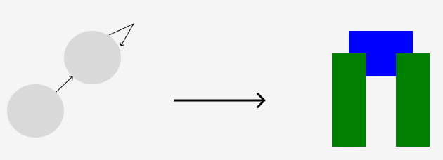
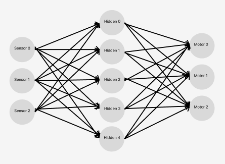
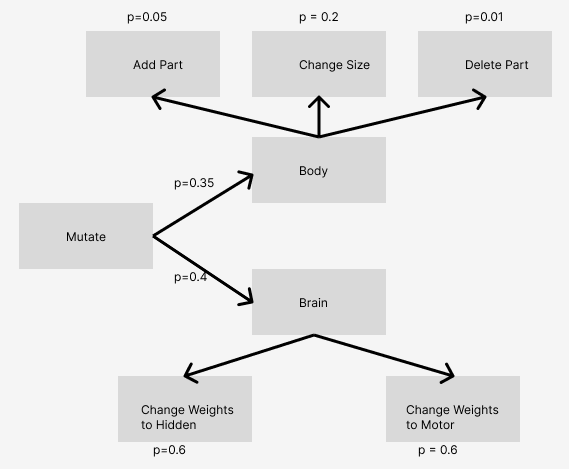
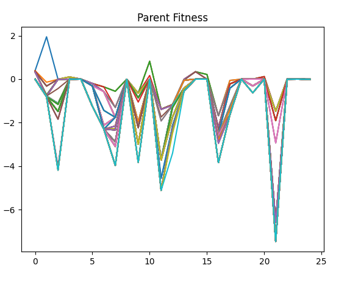
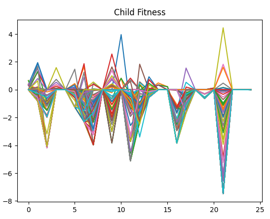

# Artificial-Life

For the current version of the main branch (merged from Evolving-Bodies-V3), I added onto Ludobots.  

# Project

## Description
In this project, I worked to build the ability to evolve bodies and brains for the simple task of locomotion in one direction.  I built on top of Ludobots, which you can find in the citations.

## Generation of Bodies
To generate bodies, I utilized the same indirect encoding as Karl Sims in his paper (see citations).

Above is a diagram that shows an example of this, with the directed graph on the left forming, as an example, the figure on the right, where the green blocks have sensors and the blue don't.

## Generation of the Brain
The brain is generated by first randomly assigning sensor neurons to some links, and assigning motor neurons to all links.  There's a hidden layer in between, and the network is fully connected.

Above is one example of a possible brain.

## Mutation

The graph above shows the probability of given mutations.  Worth noting is that I made the probability of any mutations to the body lower, both because I believe that in biological creatures it's harder to change your body than brain, and also because it saves compute time since whenever the body evolves, you have to go back through its generation procedure.

## Selection
To select for the robots that should be evolved further, we used a parallel hill climber methodology wherein we have some population, which we then clone and mutate, and within each "silo" of parent/child pairs, we select the one with the better fitness (higher x-value in this case) to be the one that continues evolving.

## Running It
Once you've installed the prerequisites (there are a lot, sorry), you can then do a few things.  The first option is to simply run main.py.  Doing this will provide you with the option to either run evolution from scratch, or see some of the best runs that I made.

## Some Results
Below are two graphs containing parent and child fitness values.

Weirdly, it seems like the parent doesn't increase in fitness monotonically as it should.

## A 10-Second Teaser
Unfortunately, README on GitHub doesn't seem to support videos.  So, the video can be found [here]()

## 2-Minute Video
Unfortunately, README on GitHub doesn't seem to support videos.  So, the video can be found [here]()

# Citations
Karl Sim's Paper on evolution in a digital environment, found [here](https://www.karlsims.com/papers/alife94.pdf)

This project built upon the Ludobots course, which can be found [here](https://www.reddit.com/r/ludobots/).

The class this project came from is listed as Computer Science 396 at Northwestern University, the section is Artificial Life taught by Sam Kriegman.  The syllabus for the class can be found [here](https://docs.google.com/document/d/1jURIbvpQ0imcaMk-AHUmj_szZNtsA4lZAlcqXa6usXs/edit).
