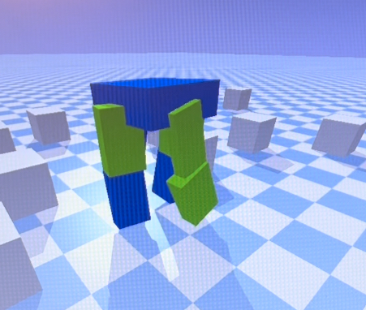
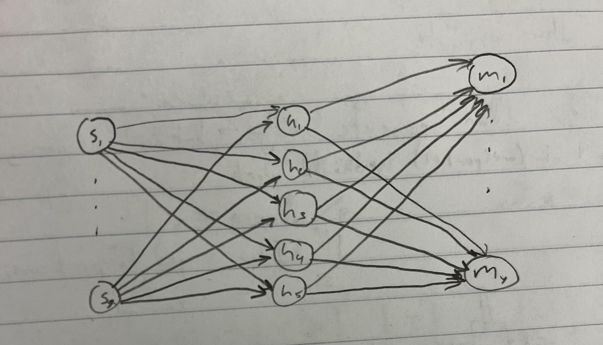
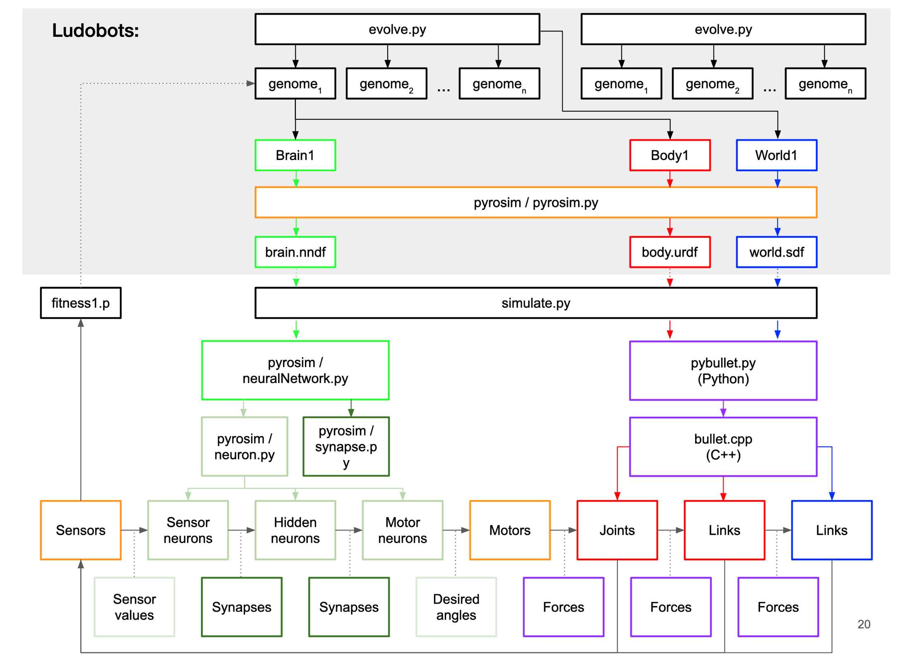

# Artificial-Life

For the current version of the main branch (merged from Evolving-Bodies-V3), I added onto Ludobots.  

# Assignment 7
## Overview
In this assignment, I modified solution.py among other files so that I could procedurally generate 3-D morphologies with some randomness.  These changes can be seen in the branch 3D-Body-Gen.  Right now, running main.py will rapidly generate a sequence of creatures as specified in the Generation section, with randomly assigned sensor neurons for the individual links, which are green if there is a sensor present, blue otherwise.

## Generation

The body is generated using a directed graph with nodes serving as the links, and edges as the joints.  The idea is that this is to be a template for an indirect encoding, however at the moment the only type of body encoded is a quadruped with the potential for variable length legs where all four legs would be have the same number of links, but could have differing lengths.  The indirect encoding is shown in the diagram below.
</img>
An instance of this is shown in the following image.
</img>
As for the brain, it was generated partly alongside the body, by randomly picking which links would get a sensor neuron, with a 70% probability that they would.  The brain can then be envisioned as a completely connected neural net where the set of sensors is the input layer, there is a hidden layer with a constant number of five hidden neurons (future experimentation will randomize this as well as add the potential for more hidden layers), with the output layer consisting of one motor neuron for every joint.  See the diagram below.
</img>

## Codebase

The following diagram illustrates most of the codebase's structure, courtesy of Professor Kriegman (see citations below).
</img>
Though, instead of evolve.py, we use search.py which makes calls to parallelHillClimber.py to actually do the evolution, where each call to solution.py within parallelHillClimber.py is equivalent to the genome blocks.

## Video Demonstration
<iframe width="640" height="360" src="https://youtu.be/k8zppb4T30M" alt="Video of 3D Generating Ludobots" allowfullscreen></iframe>

# Citations
This project built upon the Ludobots course, which can be found [here](https://www.reddit.com/r/ludobots/).

The class this project came from is listed as Computer Science 396 at Northwestern University, the section is Artificial Life taught by Sam Kriegman.  The syllabus for the class can be found [here](https://docs.google.com/document/d/1jURIbvpQ0imcaMk-AHUmj_szZNtsA4lZAlcqXa6usXs/edit).
