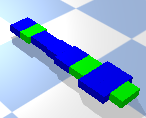

# Artificial-Life

For the current version of the main branch (merged from Person), I added onto Ludobots.  The Person Branch was created from the Quadrupeds Branch, which is the last
part covered by Ludobots.  Person has a few changes.  First off, I switched the morphology to that of a biped with feet.  Second, I added a hidden layer with five
neurons.  Third, I came up with a way to procedurally generate a brain based off of a solution's body.  It is my hope that in the future I can figure out a way to
procedurally generate the body too, but when I tried this it went poorly to say the least.

# Assignment 6
## Overview
In this assignment, I modified solution.py among other files so that I could procedurally generate 1-D morphologies with some randomness.  These changes can be seen in the branch 1D-Body-Gen.  Right now, running main.py will rapidly generate a sequence of creatures from length 1 to 10, with randomly assigned sensor neurons for the individual links, which are green if there is a sensor present, blue otherwise.

## Possible Morphologies
As mentioned before, the morphologies are 1-D chains of links.  At this time, the joints only move in one direction and are still revolute, as it took most of my time to figure out how to get the bodies to actually generate properly.

Diagram of a Possible Morphology

As you can see, the links for a chain of varying length and width, with blue links having no sensors and green links having sensors.

## Possible Brains
At the moment, the brain hasn't really advanced.  There are still 5 hidden neurons, but only in one layer.  Perhaps in the future I'll begin to add more layers, but as things stand that isn't yet a priority.  One minor change is that since each link doesn't have a sensor any longer, there are fewer sensor neurons.  At the moment, a link has a 70% chance of having a sensor.

# Citations
This project built upon the Ludobots course, which can be found [here](https://www.reddit.com/r/ludobots/).

The class this project came from is listed as Computer Science 396 at Northwestern University, the section is Artificial Life taught by Sam Kriegman.  The syllabus for the class can be found [here](https://docs.google.com/document/d/1jURIbvpQ0imcaMk-AHUmj_szZNtsA4lZAlcqXa6usXs/edit).
